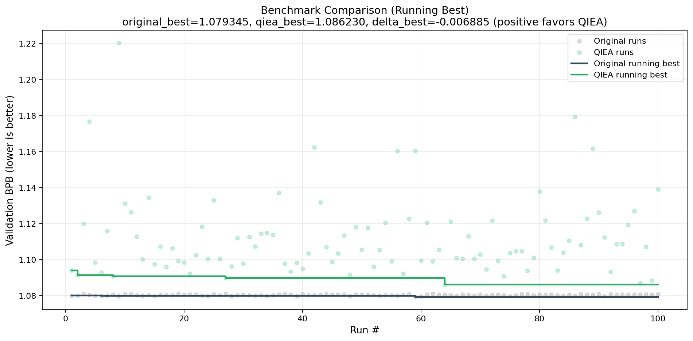
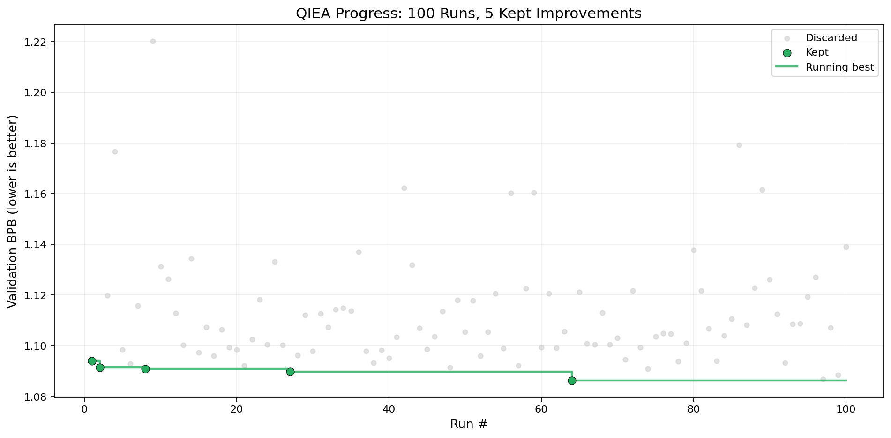
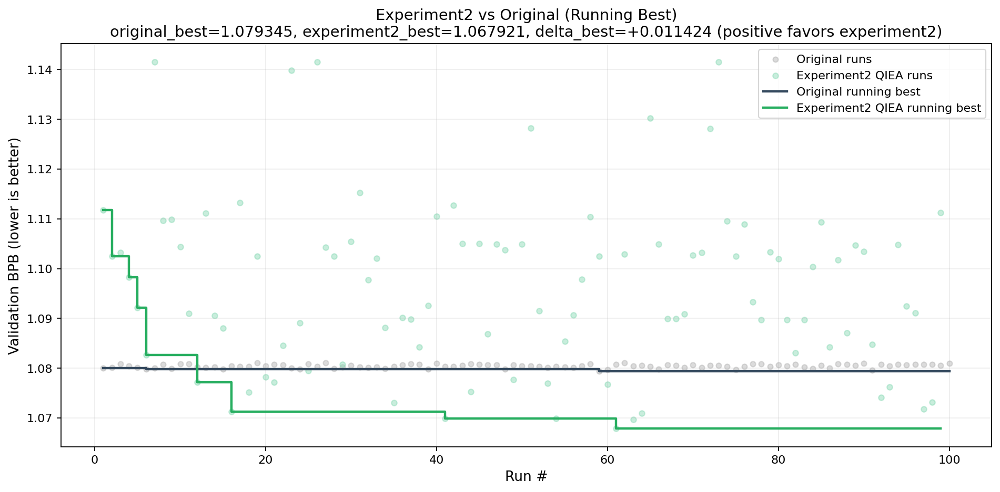
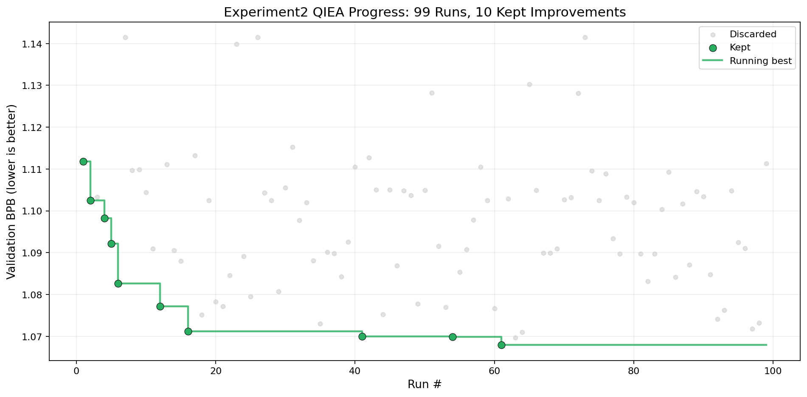

# Results: QIEA Experiments vs Original AutoResearch

## Overview

I ran two QIEA variants against the same original baseline and compared them on val_bpb (lower is better).

- Baseline data: [original/bench/original_results.csv](original/bench/original_results.csv)
- Experiment 1 setup: [experiment1/EXPERIMENT.md](experiment1/EXPERIMENT.md)
- Experiment 2 setup: [experiment2/EXPERIMENT.md](experiment2/EXPERIMENT.md)

At a high level, Experiment 1 explores continuous hyperparameters, while Experiment 2 explores binary architecture choices.

## What was different between the two QIEA experiments?

Experiment 1 kept the model structure fixed and let QIEA sample 10 continuous knobs like learning rates, betas, warmup/warmdown, weight decay, and dropout.

Experiment 2 switched to structural search. Each run sampled a binary blueprint (for example norm type, attention mode, MLP type, value embeddings on/off, qk norm on/off, RoPE base), then applied that blueprint directly to the architecture before training.

So the contrast is basically continuous optimizer-space search vs discrete architecture-space search.

## Quick quantitative summary

All numbers below use successful rows (status=ok).

| Variant | Successful runs | Best val_bpb | Mean val_bpb | Std dev | Range (max-min) | Delta vs baseline best |
|---|---:|---:|---:|---:|---:|---:|
| Original baseline | 100 | 1.079345 | 1.080419 | 0.000368 | 0.001730 | 0.000000 |
| Experiment 1 QIEA | 100 | 1.086230 | 1.111737 | 0.021899 | 0.133961 | -0.006885 |
| Experiment 2 QIEA | 99 | 1.067921 | 1.096095 | 0.016813 | 0.073585 | +0.011424 |

How to read the last column:

- Positive means the QIEA variant beat the best baseline run.
- Negative means it did not.

Most important takeaway:

- Experiment 1 never beat baseline.
- Experiment 2 did, by +0.011424 at its best run.
- 19 out of 99 Experiment 2 runs were better than the baseline best.

## Plots

## Experiment 1

### Running best vs original

### QIEA run distribution and keeps

## Experiment 2

### Running best vs original

### QIEA run distribution and keeps

## What stood out in the results

The baseline is very stable. Its spread is tiny (range 0.001730, std 0.000368), which means it sits in a narrow, predictable regime.

Both QIEA variants explored much more broadly, which you can see immediately in the scatter clouds and in the ranges:

- Baseline range: 0.001730
- Experiment 1 range: 0.133961 (about 77x wider)
- Experiment 2 range: 0.073585 (about 42x wider)

That wider search is exactly what you want for discovery, but it can cut both ways.

For Experiment 1, the extra exploration mostly landed in worse regions. It did find some decent runs, but not enough concentration near truly good settings, so it stayed above baseline at the best point.

Experiment 2 looked different: it found improvements repeatedly and then settled into a better running-best trajectory, with a best run at run 61 (1.067921).

There are also useful correlations inside Experiment 2:

- RMSNorm beat LayerNorm in both minimum and mean over these runs.
- ReLU2MLP beat SwiGLUMLP for this 5-minute budget.
- Using value embeddings and qk norm tended to help.
- RoPEBase50k was better than RoPEBase10k in this benchmark.

These are benchmark-specific observations, not universal rules.

## Why this probably happened

My read is that three effects are interacting.

First, QIEA is inherently an exploration-then-bias process. Early on, amplitudes are uncertain, so runs scatter widely. As feedback arrives, probability mass shifts toward successful choices. That mechanism naturally creates larger variance than a fixed baseline.

Second, the 5-minute fixed budget strongly rewards fast early optimization, not necessarily the globally best long-run configuration. Some settings that are great at 50k steps are not the ones that win in a short window.

Third, the search space geometry matters a lot. Experiment 1 searched a broad continuous space with many coupled knobs. Under short budgets, that tends to produce many unstable or slow-starting combinations, which can drown out gains. Experiment 2 searched discrete architecture switches with clearer, higher-leverage effects on optimization dynamics. That space seems easier for QIEA to navigate efficiently in this setup.

Put differently: both experiments paid the exploration cost, but only Experiment 2 consistently converted that cost into better minima than baseline.

## Bottom line

- QIEA is not automatically better than baseline; success depends on the search space.
- In this setup, continuous hyperparameter QIEA (Experiment 1) explored widely but underperformed baseline.
- Binary architecture QIEA (Experiment 2) explored widely and produced a clear best-run win over baseline.
